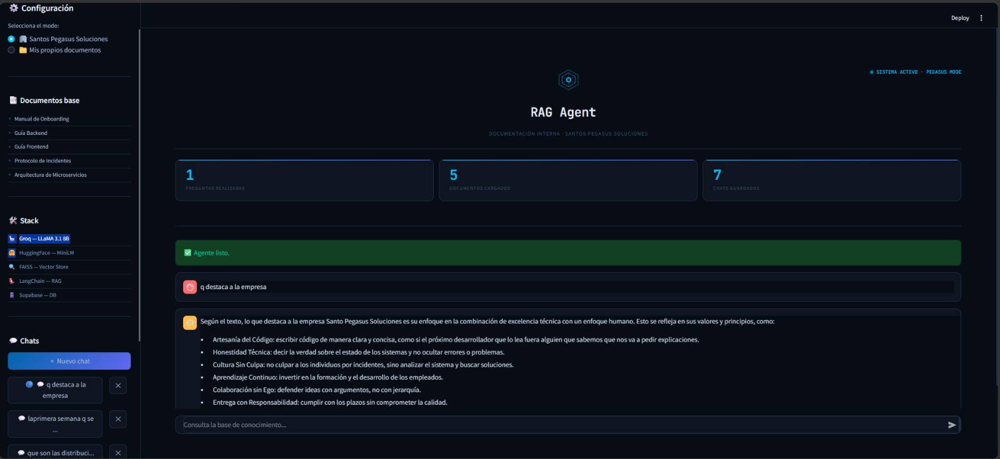
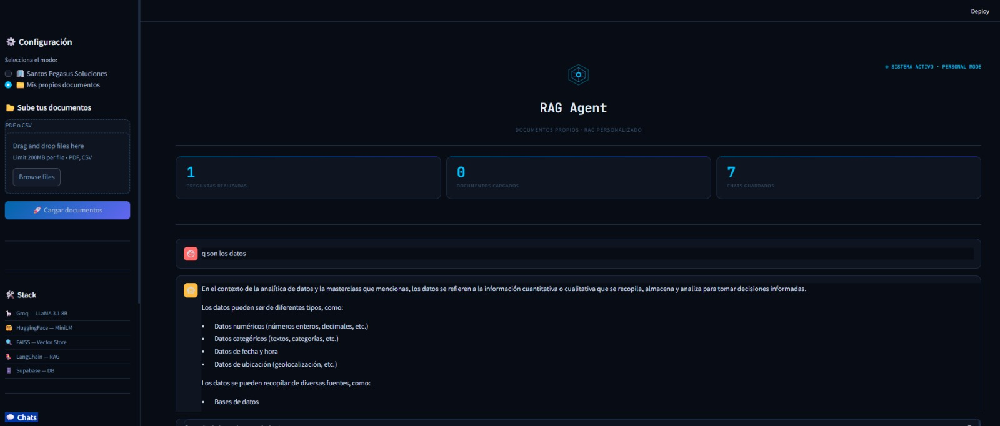
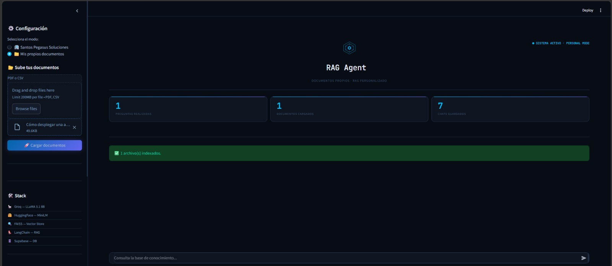

<div align="center">


# 🤖 Alura Agente RAG Pro


### Agente Inteligente de Documentos con IA Generativa


[](https://python.org)

[](https://langchain.com)

[](https://groq.com)

[](https://streamlit.io)

[](https://supabase.com)

[](https://huggingface.co)

[](https://cloud.google.com)


*Challenge Alura + Oracle ONE — Proyecto Final*


</div>


---


## 📋 Descripción del Proyecto


**Alura Agente RAG Pro** es un agente de inteligencia artificial capaz de responder preguntas en lenguaje natural sobre cualquier documento (PDF o CSV), sin necesidad de abrirlo manualmente. Fue desarrollado como proyecto final del **Challenge Alura Agente** del programa Oracle Next Education (ONE).


El agente opera en **dos modos**:


- **🏢 Modo Santos Pegasus Soluciones:** Consulta la documentación interna de una empresa de tecnología ficticia (manuales de onboarding, guías de ingeniería, protocolos de incidentes y arquitectura de microservicios).

- **📁 Modo Documentos Personalizados:** El usuario sube sus propios archivos PDF o CSV y el agente responde preguntas sobre ellos. Los documentos quedan guardados en la nube y los chats son persistentes entre sesiones.


---


## 🚀 Demo y Deploy


> 🌐 **Aplicación en producción:** http://136.64.155.76:8501







## 🎬 Demo en Video

[](https://udistritaleduco-my.sharepoint.com/:v:/g/personal/iabeltrang_udistrital_edu_co/IQDNfpCgvbeUSK8fX-sCyFpDAZl0T8qxMqVii_k_PjV_ahY?nav=eyJyZWZlcnJhbEluZm8iOnsicmVmZXJyYWxBcHAiOiJPbmVEcml2ZUZvckJ1c2luZXNzIiwicmVmZXJyYWxBcHBQbGF0Zm9ybSI6IldlYiIsInJlZmVycmFsTW9kZSI6InZpZXciLCJyZWZlcnJhbFZpZXciOiJNeUZpbGVzTGlua0NvcHkifX0&e=aJkM4V)


---


## 🧠 Arquitectura y Flujo RAG


El sistema implementa la arquitectura **RAG (Retrieval-Augmented Generation)** en cuatro etapas:


```

┌─────────────────────────────────────────────────────────────┐

│                     FLUJO RAG COMPLETO                      │

├─────────────────────────────────────────────────────────────┤

│                                                             │

│  1. INGESTA          PDF/CSV  ──►  Chunks de texto          │

│                                        │                    │

│  2. VECTORIZACIÓN    Chunks  ──►  Embeddings (HuggingFace)  │

│                                        │                    │

│                               FAISS Vector Store            │

│                                        │                    │

│  3. RECUPERACIÓN     Pregunta ──►  Embedding de consulta    │

│                                        │                    │

│                               Búsqueda semántica (k=4)      │

│                                        │                    │

│  4. GENERACIÓN       Contexto + Pregunta ──►  Groq LLaMA    │

│                                        │                    │

│                                   Respuesta + Fuentes       │

│                                                             │

└─────────────────────────────────────────────────────────────┘

```


**Características adicionales:**

- **Memoria conversacional:** El agente recuerda las últimas 5 interacciones dentro de una sesión usando `ConversationalRetrievalChain`.

- **Persistencia de chats:** Los historiales se guardan en Supabase y los documentos en Supabase Storage, permitiendo retomar conversaciones después de cerrar el navegador.

- **Fuentes citadas:** Cada respuesta muestra el documento y número de página de donde se extrajo la información.


---


## 🛠️ Tecnologías Utilizadas


| Categoría | Tecnología | Descripción |

|-----------|-----------|-------------|

| **LLM** | Groq (LLaMA 3.1 8B Instant) | Generación de respuestas en lenguaje natural |

| **Embeddings** | HuggingFace `all-MiniLM-L6-v2` | Vectorización local sin límites de cuota |

| **Vector Store** | FAISS | Búsqueda semántica eficiente |

| **Orquestación** | LangChain 0.3 | Framework RAG y memoria conversacional |

| **Interfaz** | Streamlit 1.45 | Aplicación web interactiva |

| **Base de datos** | Supabase PostgreSQL | Historial de chats persistente |

| **Storage** | Supabase Storage | Almacenamiento de PDFs y CSVs en la nube |

| **Lectura de docs** | PyPDF + Pandas | Procesamiento de PDFs y CSVs |

| **Deploy** | Google Cloud Platform (GCP) | VM Compute Engine |


---


## 📁 Estructura del Proyecto


```

-alura-agente-rag-pro/

├── src/

│   ├── main.py              # Interfaz Streamlit (modo dual, chats, UI)

│   ├── rag_agent.py         # Lógica RAG con LangChain y Groq

│   ├── document_loader.py   # Carga y chunking de PDFs y CSVs

│   └── database.py          # Funciones Supabase (chats + storage)

├── docs/

│   ├── Manual de Onboarding — Santos Pegasus.pdf

│   ├── Guía Oficial de Ingeniería Back-end.pdf

│   ├── Guía Oficial de Ingeniería Front-end.pdf

│   ├── Protocolo de Respuesta a Incidentes.pdf

│   └── Arquitectura de Microservicios.pdf

├── .streamlit/

│   └── config.toml          # Tema visual oscuro personalizado

├── vector_store/            # FAISS index (generado localmente)

├── .env.example             # Plantilla de variables de entorno

├── requirements.txt         # Dependencias del proyecto

└── README.md

```


---


## ⚙️ Instalación y Configuración


### Prerrequisitos


- Python 3.12+

- Git

- Cuenta en [Groq](https://console.groq.com) (gratuita)

- Cuenta en [Supabase](https://supabase.com) (gratuita)


### 1. Clonar el repositorio


```bash

git clone https://github.com/ianjaner75/-alura-agente-rag-pro.git

cd -alura-agente-rag-pro

```


### 2. Crear entorno virtual e instalar dependencias


```bash

python -m venv venv


# Windows

venv\Scripts\activate


# Linux/Mac

source venv/bin/activate


pip install -r requirements.txt

```


### 3. Configurar variables de entorno


Crea un archivo `.env` en la raíz del proyecto:


```env

GROQ_API_KEY=tu_api_key_de_groq_aqui

SUPABASE_URL=https://tu-proyecto.supabase.co

SUPABASE_KEY=tu_anon_public_key_aqui

```


### 4. Configurar Supabase


Ejecuta este SQL en el editor de Supabase:


```sql

-- Crear tablas

CREATE TABLE chats (

    id UUID DEFAULT gen_random_uuid() PRIMARY KEY,

    titulo TEXT NOT NULL,

    modo TEXT NOT NULL,

    archivos JSONB DEFAULT '[]',

    creado_at TIMESTAMP DEFAULT NOW(),

    actualizado_at TIMESTAMP DEFAULT NOW()

);


CREATE TABLE mensajes (

    id UUID DEFAULT gen_random_uuid() PRIMARY KEY,

    chat_id UUID REFERENCES chats(id) ON DELETE CASCADE,

    rol TEXT NOT NULL,

    contenido TEXT NOT NULL,

    fuentes JSONB DEFAULT '[]',

    creado_at TIMESTAMP DEFAULT NOW()

);


-- Habilitar RLS

ALTER TABLE chats ENABLE ROW LEVEL SECURITY;

ALTER TABLE mensajes ENABLE ROW LEVEL SECURITY;


CREATE POLICY "Permitir todo en chats" ON chats FOR ALL USING (true) WITH CHECK (true);

CREATE POLICY "Permitir todo en mensajes" ON mensajes FOR ALL USING (true) WITH CHECK (true);


-- Storage policy

CREATE POLICY "Permitir todo en storage" ON storage.objects

FOR ALL USING (bucket_id = 'documentos') WITH CHECK (bucket_id = 'documentos');

```


También crea un bucket llamado `documentos` en Supabase Storage.


### 5. Ejecutar la aplicación


```bash

streamlit run src/main.py

```


Abre `http://localhost:8501` en tu navegador.


---


## 💬 Ejemplos de Uso


### Modo Santos Pegasus Soluciones


**Pregunta:** `¿Qué herramientas usa Santos Pegasus para las migraciones de base de datos?`


**Respuesta del agente:**

> Santos Pegasus utiliza Flyway para gestionar el historial de migraciones a través de una tabla de metadatos, garantizando la consistencia del esquema en todos los nodos del clúster.

>

> 📄 **Fuente:** Guía Oficial de Ingeniería Back-end.pdf — Página 12


---


**Pregunta:** `¿Cuáles son los lenguajes y frameworks del backend?`


**Respuesta del agente:**

> El ecosistema principal está basado en Java 17+ y Spring Boot 3+, con una arquitectura en capas que separa Controllers, Services y Repositories.

>

> 📄 **Fuente:** Guía Oficial de Ingeniería Back-end.pdf — Página 3


---


### Modo Documentos Personalizados


Sube cualquier PDF o CSV y pregunta:


**Pregunta:** `¿Cuál es la fórmula de la distribución de Poisson?`


**Respuesta del agente:**

> La fórmula de la distribución de Poisson es: P(x) = (λˣ · e⁻λ) / x!, donde λ es el parámetro de la distribución que representa la media, e es la constante de Euler (≈2.71828) y x es el número de eventos.

>

> 📄 **Fuente:** GUIA_9.pdf — Página 3


---


## 🗺️ Roadmap


- [x] Agente RAG con documentos de Santos Pegasus

- [x] Modo dual con upload de documentos propios (PDF y CSV)

- [x] Persistencia de chats con Supabase

- [x] Almacenamiento de documentos en Supabase Storage

- [x] Memoria conversacional entre turnos

- [x] Fuentes citadas con número de página

- [x] Interfaz moderna con tema oscuro personalizado

- [x] Deploy en Google Cloud Platform (GCP)

- [ ] Soporte de múltiples usuarios con autenticación

- [ ] Análisis de imágenes con modelos multimodales

- [ ] Exportar historial de chat en PDF

- [ ] Integración con bases de datos vectoriales en producción (Pinecone/Qdrant)


---


## 👨‍💻 Autor


**Ianjaner Beltrán Guañarita** — Backend Developer Junior  

Estudiante de Ingeniería en Telemática — Universidad Distrital Francisco José de Caldas  

Programa Oracle Next Education (ONE) — Alura LATAM  


[](https://github.com/ianjaner75)

[](https://www.linkedin.com/in/ianjaner-beltran/)


---


<div align="center">


Desarrollado con ❤️ para el **Challenge Alura Agente — Oracle ONE 2026**


</div>

